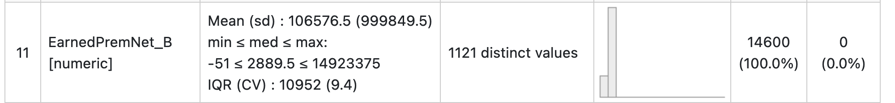

```{r setup, include=FALSE}
knitr::opts_chunk$set(echo = FALSE)
library(reticulate)
use_condaenv(condaenv = "r-reticulate")
print(py_config())
```

## Outline

- Overview
- R - summarytools
- Python - Pandas Profiling
- Python - Great Expectations
- Questions

# Overview

## Overview

We'll talk through ways to quickly and easily evaluate data quality before actuarial analyses begin.

Data sets are entirely fictional but represent real-world problems I have encountered in my actuarial career.

The source, fictional data, and presentation are available at https://github.com/ActuarialHero/data_quality

## Motivation

At Explore Information Services, I interact with over 100 insurance carriers in my work at Explore Information Services, and we exchange a **lot** of data.

The data I receive varies drastically in quality, from truly immaculate to needing to replace the file.

## ASOP 23 - Data Quality

ASOP 23 provides guidance to actuaries when

1. selecting data,
2. performing a review of data, 
3. using data, or 
4. relying on data supplied by others,

in performing actuarial services.

## ASOP 23 - Section 3.3

A review of data may not always reveal defects. Nevertheless, the actuary should perform a review, unless, in the actuary’s professional judgment, such review is not necessary or not practical. In exercising such professional judgment, the actuary should take into account the purpose and nature of the assignment, any relevant constraints, and the extent of any known checking, verification, or audit of the data that has already been performed.

If, in the actuary’s professional judgment, it is not appropriate to perform a review of the data, the actuary should disclose that the actuary has not performed such a review, the reason the actuary has not performed such a review, and any resulting limitations on the use of the actuarial work product, in accordance with section 4.1(c).

## ASOP 23 - Section 3.3

If the actuary performs a review, the actuary should do the following:

a. make a reasonable effort to determine the definition of each data element used in the analysis; and
b. make a reasonable effort to identify data values that are questionable or relationships that are significantly inconsistent. If the actuary believes questionable or inconsistent data values could have a significant effect on the analysis, the actuary should consider taking further steps, when practical, to improve the quality of the data. The actuary should disclose in summary form any unresolved questionable data values that the actuary believes could have a significant effect on the analysis, in accordance with section 4.1(d). The actuary also should disclose any significant steps the actuary has taken to improve the data, in accordance with section 4.1(e).

If the actuary performs a review, the actuary should also consider comparing current data with the data used in the prior analysis for consistency, if similar work has been previously performed for the same or recent periods and if such consistency can reasonably be expected. If the actuary does not have the prior data, the actuary should consider requesting the prior data.

## Poll Question 1

Is your company, principal, or client's data perfect?

1. Yes
2. No
3. Maybe

## Data Sources for this presentation

We'll work through the following example data sets today:

1. Reserving data from Glenn Meyer's excellent Monograph. Available from the CAS website.
2. A synthetic (randomly generated, somewhat representative) modeling data set.

## Poll Question 2

What tools do you normally use for working with data? [Multi-choice]

1. R
2. Python
3. SAS
4. Excel
5. Other - [Specify in chat]

# R summarytools Package

## Overview

From the website:

"summarytools is a an R package for data cleaning, exploring, and simple reporting. The package was developed with the following objectives in mind:

* Provide a coherent set of easy-to-use descriptive functions that are akin to those included in commercial statistical software suites such as SAS, SPSS, and Stata
* Offer flexibility in terms of output format & content
* Integrate well with commonly used software & tools for reporting (the RStudio IDE, Rmarkdown, and knitr) while also allowing for standalone, simple report generation from any R interface"

## Reserving Data

This section is based on the reserving data set constructed by Glenn Meyers and posted on the CAS website. The data is in CSV format with the following variables:

* **GRCODE** - NAIC company code (including insurer groups and single insurers)
* **GRNAME** - NAIC company name (including insurer groups and single insurers)
* **AccidentYear** - Accident year
* **DevelopmentYear** - Development year
* **DevelopmentLag** - Development lag (AY-1987 + DY-1987 - 1)
* **IncurLoss_** - Incurred losses and allocated expenses reported at year end
* **CumPaidLoss_** - Cumulative paid losses and allocated expenses at year end

## Reserving Data (cont.)

This section is based on the reserving data set constructed by Glenn Meyers and posted on the CAS website. The data is in CSV format with the following variables:

* **BulkLoss_** - Bulk and IBNR reserves on net losses and defense and cost containment expenses reported at year end
* **PostedReserve97_** - Posted reserves in year 1997 taken from the Underwriting and Investment Exhibit - Part 2A, including net losses unpaid and unpaid loss adjustment expenses
* **EarnedPremDIR_** - Premiums earned at incurral year - direct and assumed
* **EarnedPremCeded_** - Premiums earned at incurral year - ceded
* **EarnedPremNet_** - Premiums earned at incurral year - net
* **Single** 1 = single entity and 0 = group insurer

## Getting the data into R

Here are four commonly-used packages for importing data into R:

* **readr** - For importing rectangular data (like comma separated values, tab separated values, and fixed width format)
* **readxl** - For importing .xls and .xlsx files into R without the need for external dependencies (like xlsx or xlsReadWrite).
* **RODBC** - For importing data from databases using ODBC.
* **odbc** - A newer package for connecting to databases via ODBC.

## Getting the data into R

Today, we'll use the **read_csv** function in the **readr** package to read in the Private Passenger Auto reserving data since it's in CSV format. There are a few options for reading in CSV files, but read_csv does a pretty good job at guessing fields. That said, we can override read_csv's guesses if needed.

```{r, echo = TRUE}
library(readr)
pp_auto <- read_csv("../../data_in/meyers/ppauto_pos.csv")
```

## Profiling: Code

My team uses dfSummary from the summarytools package to examine data once it's in R. A single line of code, dfSummary, generates an HTML file with information about the data set and each of its fields in nicely formatted HTML file. Snippets from this about are split across the next X slides.

```{r, echo = TRUE}
library(summarytools)
view(dfSummary(pp_auto), file = "../../data_out/pp_auto_profile.html")
```

## Profiling: Record Counts and Duplicates

```{r, out.width = "800px"}
knitr::include_graphics("../../images/pp_auto_01.png")
```

There 14,600 observations in the data set, and none are duplicates.

## Profiling: GRCODE

```{r, out.width = "800px"}
knitr::include_graphics("../../images/pp_auto_02.png")
```

- The variable was treated as numeric. This may or may not be appropriate since it's a code. Some, such as ZIP Codes, may need leading Zeros.
- Since it was numeric, it generated numeric summary statistics that we can ignore.
- There are 146 distinct values. The Monograph discuses 50 carriers for each line, so they are probably a subset of this data.

## Profiling: GRNAME

```{r, out.width = "800px"}

```

- GRNAME is treated as a character variable
- The names look like the names of insurer groups
- The values are sorted from most to least common, with ties broken by alphabetical order. We see that the first 10 values appear 100 times each.
- No values are missing

## Profiling: AccidentYear

```{r, out.width = "800px"}

```

- AccidentYear is treated as a numeric variable
- They run from 1988 - 1997
- Each AccidentYear appears 1460 times. Note that we don't normally expect the most recent accident year to have the same number of observations, so this means this triangle may have completed it's development.

## Profiling: DevelopmentYear

```{r, out.width = "800px"}
knitr::include_graphics("../../images/pp_auto_05.png")
```

- This distribution looks a little strange. I would have expected a symmetrical distribution. We can take a closer look with the dplyr package.

## Profiling: DevelopmentYear

```{r, echo = TRUE, message=FALSE}
library(dplyr)
pp_auto %>% count(DevelopmentYear) %>% head(n = 10)
```

## Profiling: DevelopmentYear

```{r, echo = TRUE, message=FALSE}
pp_auto %>% count(DevelopmentYear) %>% tail(n = 10)
```

## Profiling: DevelopmentLag

```{r, out.width = "800px"}

```

- Development lag (or sometimes referred to as age) is uniform. This confirms our earlier intuition that the triangle may have completed development.

## Profiling: IncurLoss_B & CumPaidLoss_B

```{r, out.width = "800px"}
knitr::include_graphics("../../images/pp_auto_07.png")
```

- The distributions are skewed.
- Some values are negative in both fields. Let's take a look.

## Profiling: CumPaidLoss_B

```{r, echo = TRUE}
pp_auto %>%
    filter(IncurLoss_B < 0) %>%
    select(GRNAME, AccidentYear, IncurLoss_B) %>%
    arrange(IncurLoss_B) %>%
    head(n = 9)
```

## Profiling: CumPaidLoss_B

```{r, echo = TRUE}
pp_auto %>%
    arrange(desc(IncurLoss_B)) %>%
    select(GRNAME, AccidentYear, IncurLoss_B) %>%
    head(n = 10)
```

## Profiling: EarnedPremDIR_B & EarnedPremiumCeded_B

Let's skip a more detailed review of CumPaidLoss_B and BulkLoss_B and head straight for the premium variables:

```{r, out.width = "800px"}

```

- These are also skewed.
- There are a few negatives. We'd probably want to peak to make sure they aren't unreasonable.

## Profiling: EarnedPremNet_B

And next is our net premium variable:

```{r, out.width = "800px"}

```

- Similar observations to the other slides premium variables, but we should check to make sure Direct, Ceded, and Net all tie out.

## Profiling: Premium Balancing

```{r, echo = TRUE}
pp_auto %>% 
    mutate(PremBalAbs = abs(EarnedPremNet_B - (EarnedPremDIR_B - EarnedPremCeded_B))) %>%
    filter(PremBalAbs != 0) %>%
    count(GRNAME, PremBalAbs, sort = TRUE) %>% head(n = 10)
```

## Profiling: Single

There are more single companies than groups in this data set:

```{r, out.width = "800px"}

```

We should also make sure none of the codes has both the single and group values:

```{r, echo = TRUE}
pp_auto %>% 
    distinct(GRCODE, Single) %>%
    count(GRCODE) %>%
    filter(n > 1)
```

# Python pandas-profiling

## Overview

Similar to summarytools for R users, Python users can use Pandas profile. This example uses a fictional list of Kansas personal auto policies.

```{python, echo = TRUE, message = FALSE, results='hide'}
import pandas
from pandas_profiling import ProfileReport

pp_auto = pandas.read_csv("../../data_mid/auto_policy.csv")
profile = ProfileReport(pp_auto, title = "Auto Policy Profile")
profile.to_file("../../data_out/auto_policy_profile.html")

```

## Auto Driver/Policy Profile

Here's the same data set with driver information attached:

```{python, echo = TRUE, message = FALSE, results='hide'}
import pandas
from pandas_profiling import ProfileReport

pp_auto = pandas.read_csv("../../data_mid/auto_policy_driver.csv")

pp_auto = pp_auto.astype({"claim_count": float})

profile = ProfileReport(pp_auto, title = "Auto Policy Driver Profile")
profile.to_file("../../data_out/auto_policy_driver_profile.html")

```

# Python - Great Expectations

## Overview

Finally, Great Expectations is a python package for Validating, Documenting, and profiling data by setting expectations.

## What Are Expecations?

Expectations can be anything. Some common ones:

* Driver's License Number should not be null
* The amount of the claim should not be negative
* The policy limit should be between $1M and $10M
* Policy state should be in this list of states
* 95% of driver ages fall between 16 and

## Setting Expectations

There are three options for setting expectations:

1. Manually, without interacting with a sample batch of data (default)
2. Interactively, with a sample batch of data
3. Automatically, using a profiler

We typically create them with a profiler and then edit them as necessary.

## Great Expectations In Modeling

You create expectations based on the data you built a model on, and then run data that is scored in production through the expectation set to verify that the model was built on appropriate data. Some examples that might fail expectations:

1. The model is being used in states that weren't considered during the initial model build.
2. The distribution of property values or liability limits varies drastically from the initial 
3. The cleanliness of the quotes being scored varies drastically from the cleanliness of written policies that were modeled. Drivers getting quotes tend to have more DUIs than drivers you insure.

## Great Expectations In Aggregating Data

When you need to aggregate data, you can build expectations on one set and run them on others to see how similar they are. Example scenarios:

* You may need to combine data from multiple systems. You may discover that the state codes are different between systems.
* You are aggregating data from multiple insurance companies 
* You are creating industry benchmarks and have many different (non-insurance) companies submitting their loss data.

# Review

## Review

- R - summarytools
- Python - Pandas Profiling
- Python - Great Expectations

# Questions

## Question

- Overview
- R - summarytools
- Python - Pandas Profiling
- Python - Great Expectations
- Questions

## Additional references

* R
    + [R for Data Science](https://r4ds.had.co.nz/) by Hadley Wickham
    + [Tidyverse Website](https://www.tidyverse.org/)
    + [summarytools GitHub Page](https://github.com/dcomtois/summarytools)
* Python
    + [Pandas Profiling](https://github.com/pandas-profiling/pandas-profiling)
    + [Great Expectations](https://greatexpectations.io/)